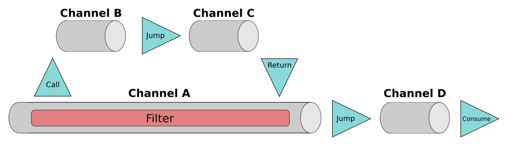
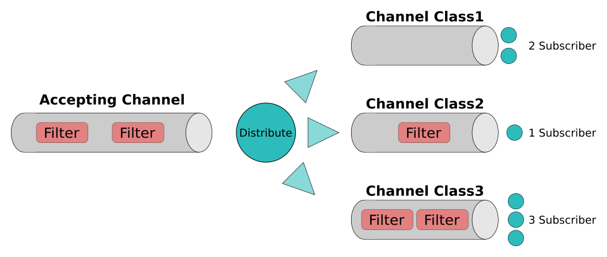

# message-mate
Message-Mate is a library for building messaging architectures.

It provides components to integrate parts of your business 
logic in a loosely coupled fashion. This allows for applications,
that are highly extensible and easily tested.

## Motivation
Messaging is a form of communication, that exchanges encapsulated messages between 
parts of an application or different applications. In contrast to other types of 
integration it models both the carrier as well as the send messages as distinct
concepts of the application. This can provide several benefits if used correctly. But it 
also can generate overhead and complexity. This library focuses on a lightweight 
implementation of messaging patterns to be wire Usecases and objects within one application. 
For integrating different applications (over network, shared memory, ...) there exist other
libraries.

This library provides implementations for typical forms of message carriers like 
Channels or MesssageBus. Explicitly modelling these transport mechanisms as distinct
objects have an beneficiary influence on the coupling of independent parts of the 
application. When parts of the application want to communicate with each other, they
send messages. The sender puts its message on the MessageBus. The MessageBus then 
ensures, that the message is delivered to all subscriber. The sender does not need to know
the number or type of the subscriber. The subscriber have no knowledge about the sender.
This lead to a very loosely coupled integration. As sender and subscriber can be added or 
removed dynamically during runtime, the application becomes very flexible. 

Both, MessageBus and Channel, can be configured to provide asynchronous aspects using 
Threads. This simplifies code using these objects, as a lot of asynchronous 
and synchronization problems are already solved. Dynamically scaling out Threads only 
required to change the configuration Channels and MessageBus. The rest of the application
can remain mostly agnostic to it. 

These messaging patterns ease the integration of Frameworks with the application's UseCses.
But also the communication between UseCases is greatly simplified with a MessageBus. Even
at the scope of Domain Objects messaging patterns can provide loosely coupling and dynamism.

The following chapter explain all of message-mates components. In addition a sample
application is provides here [!!!], that gives examples of how to use the concepts
in a real world example.
## Basic Concepts

### Channel
A common task in message driven architectures is sending messages from a bunch of producer to 
an arbitrary amount of consumer, handling errors and allowing to add Filter dynamically.
In MessageMate Channels provide these kind of properties:
 - add or remove sender and receiver dynamically
 - define the type of send messages, when sender and receiver have agreed on the format of the send messages
 - change the messages during the transportation via Filter: changing the contents of the message, blocking invalid messages,...
 - abstract configuration: once the Channel is created, the participants should be agnostic about the used configuration, e.g. whether the Channel is asynchronous
 - dynamic extension points: add Filter, add logging or even replace the subscriber during tests
 - monitoring: get information about the number of messages that got delivered successful, blocked or failed with exceptions
 
#### Creating a Channel
Channel can be created using the `ChannelBuilder` class:

```java
Channel<TestMessage> channel = ChannelBuilder.aChannel(TestMessage.class)
    .forType(ChannelType.SYNCHRONOUS)
    .withDefaultAction(Consume.consumeMessage(m -> {
        System.out.println(m);
    }))
    .build();

channel.send(new TestMessage());
```
Channels can be of type `SYNCHRONOUS` (which is the default) or of type `ASYNCHRONOUS`.
Synchronous Channels will execute the delivery on the Thread calling `send`. Asynchronous
Channels bring their own Threadpool with them. For more details on how to create and configure
asynchronous Channels see [!!!]

At the end of a Channel an Action is executed for each message. Actions abstract
the consumer part of the messaging. The simplest Action is the `Consume` Action 
which executes the given logic for each message that reached the end of the Channel. 
Other Actions allow dynamic subscriptions or jumps to other Channels.

#### Actions
Each message reaching the end of the Channel will be consumed by an Action. This can
be the default Action defined during creation time or a dynamically changed by Filter 
(explained below). Several default Actions exist:

##### Consume
A `Consume` Action calls the given Consumer function for every message that reached
the end of the Channel:

```java
Action<T> action = Consume.consumeMessage(m -> {
    System.out.println(m);
});
```

##### Subscription
The `Subscription` Action extends the `Consume` Action with the ability of having 
several consumers, called Subscriber. The `Subscription` Action allows for adding and
removing Subscriber dynamically:

```java
Subscription<Object> subscription = Subscription.subscription();

Consumer<Object> consumer = m -> {
    System.out.println(m);
};
SubscriptionId subscriptionId = subscription.addSubscriber(consumer);

subscription.removeSubscriber(subscriptionId);

Subscriber<Object> subscriber = ConsumerSubscriber.consumerSubscriber(consumer);
SubscriptionId subscriptionId = subscription.addSubscriber(subscriber);
subscription.removeSubscriber(subscriber);
``` 
The `addSubscriber` method is overloaded to accept either a java Consumer or 
an `Subscriber` object. Classes implementing this interface get more control 
over the management of the SubscriptionIdor the acceptance of messages, e.g. 
they can preempt the delivery, so that other subscriber do receive the message. 
See [!!!] for more details. The `addSubscriber` methods returns a `SubscriptionId`, 
which is a unique UUID generated for each `Subscriber`. It can be used to uniquely 
identify a Subscriber. The `removeSubscriber` methods makes use of this to remove
subscriptions.

##### Jump
In more complex messaging architectures larger processing logics are often split 
into smaller, logical pieces by chaining Channels. Each Channel is then responsible
for a smaller part in this flow. These Channels can be connected via `Jump`
Actions. A `Jump` Action takes a message and sends it in the next Channel:

```java
Jump<sameTypeOfBothChannels> jump = Jump.jumpTo(diffentChannel);
```

The reason to use `Jumps` and not a `Consume` calling `send` on the next Channel is 
the the control structure used in Channels. Messages send over Channels are
enveloped in `ProcessingContext` objects. These context objects contain history information over past Channels useful for debugging.
The `Jump` Action handles these context information during the change of Channels
(For more information about the `ProcessingContext` object see [!!!]).

##### Filter
Channel provide an extensible mechanism for processing messages: Filter.
A send message traverses all Filter before being consumed by the final Action.
Each Filter has two options: It can allow the message to pass or it can block the message.
A blocked message will stop its propagation through the remaining Filter and will never
reach the final Action:

```java
channel.addProcessFilter((processingContext, filterActions) -> {
    TestMessage message = processingContext.getPayload();
    if (isValid()) {
        message.validated = true;
        filterActions.pass(processingContext);
    } else {
        filterActions.block(processingContext);
    }
});
```
Calling `filterActions.pass` will propagate the message to the next Filter. 
`filterActions.block` will stop the propagation. If none of these methods are called,
the message is also blocked. But not calling the `block` method should be avoided as 
Filter should be written as explicit as possible (Also the message is marked as 
`forgotten` and not as `blocked` in the `ChannelStatistics`).

As mentioned earlier, each message is always enveloped in a `ProcessingContext` control structure.
To get access to the original message use `getPayload`. But the `pass` and
`block` methods again expect the `ProcessingContext` object. Filter can freely access the
`ProcessingContext` object. The most common usage would be to replace the Action, that
is executed at the Channel's end:

```java
channel.addPostFilter((processingContext, filterActions) -> {
    if(!processingContext.actionWasChanged()) {
        processingContext.changeAction(Consume.consumeMessage(m -> {}));
    }
});
```

Filter can be added at three different stages: Pre, Process, Post. These three different
extension points serve as coarse-grained ordering. All Filter in the Pre Stage are always
executed before the Filter in the Process stage, which themselves execute before the Post Filter.
Within these stages the order of Filter follows the contract of java's concurrent list.

For each of three stages methods exists to query registered Filter and to remove 
Filter:
```java
List<Filter<ProcessingContext<T>>> preFilter = channel.getPreFilter();
List<Filter<ProcessingContext<T>>> processFilter = channel.getProcessFilter();
List<Filter<ProcessingContext<T>>> postFilter = channel.getPostFilter();
        
channel.removePreFilter(filter);
channel.removeProcessFilter(filter);
channel.removePostFilter(filter);        
```

##### Call and Return
A special Action that can only be used inside a Filter is the `Call` Action. It is used
to perform an immediate jump to a different Channel. The transport of the message is
resumed the moment the other Channel executes a `Return` as it's final Action. This Call/Return
combination allows Filter to add arbitrarily complex logic dynamically to a Channel.

```java
Channel<TestMessage> differentChannel = ChannelBuilder.aChannel(TestMessage.class)
    .withDefaultAction(Return.aReturn())
    .build();

channel.addPostFilter((processingContext, filterActions) -> {
    Call.callTo(differentChannel, processingContext);
    System.out.println("Returned from other Channel.");
    filterActions.pass(processingContext);
});
```
Calls can be nested arbitrarily and don't need to return (Although not returning chains
of Channels are harder to debug than simply blocking a message). But returning without
a previous Call will result in an error.

The factory method `Call.callTo` executes the Call directly. If access to the `Call`
object is needed, a two step alternative exists:

```java
channel.addPostFilter((processingContext, filterActions) -> {
    final Call<TestMessage> call = Call.prepareACall(differentChannel);
    doSomethingWith(call);
    call.execute(processingContext);
});
```
#### Statistics
Each Channel provides basic logging in form of statistics itself: It logs the number of 
messages, that were
 - accepted: message was received by Channel and transport was started. A message is always
 accepted or an exception is thrown
 - queued: asynchronous Channel can queue messages, if no Threads are available. This statistic
 resembles the number of currently waiting messages
 - blocked: number of messages that were blocked by Filter
 - forgotten: number of messages that were neither passed or blocked by Filter
 - successful: number of message that passed all Filter and executed the final Action without error
 - failed: if an exception is thrown during a Filter or the final Action, the 
 message is marked as failed

 ```java
ChannelStatusInformation statusInformation = channel.getStatusInformation();
ChannelStatistics statistics = statusInformation.getChannelStatistics();
BigInteger acceptedMessages = statistics.getAcceptedMessages();
BigInteger queuedMessages = statistics.getQueuedMessages();
BigInteger blockedMessages = statistics.getBlockedMessages();
BigInteger forgottenMessages = statistics.getForgottenMessages();
BigInteger successfulMessages = statistics.getSuccessfulMessages();
BigInteger failedMessages = statistics.getFailedMessages();
Date timestamp = statistics.getTimestamp();
 ```
Each statistic contains a timestamp indicating the date, for when the given numbers
were approximately valid.

#### Shutdown
Each Channel can be closed to free resources in case the Channel was stateful 
(Asynchronous Channels are stateful). The following methods exists:

```java
boolean finishRemainingTasks = true;
channel.close(finishRemainingTasks);

boolean shutdown = channel.isShutdown();

try {
    boolean terminationSucceeded = channel.awaitTermination(5, MILLISECONDS);
} catch (InterruptedException e) {
    
}
```

These methods follow the contract, that classes from the standard java library with
these sort of methods abide to. Channel (as all closable Classes in MessageMate) 
also implement the `AutoClosable` interface and can be used in a try-with-resources statement.

#### Configuration
Configuring a Channel is done using the respective `ChannelBuilder` class' methods.

```java
ChannelBuilder.aChannel()
.forType(ChannelType.ASYNCHRONOUS)
.withAsynchronousConfiguration(asyncConfig)
.withDefaultAction(Subscription.subscription())
.withChannelExceptionHandler(customExceptionHandler)
.withActionHandlerSet(customActionHandlerSet)
.build();
```

The available Actions were discussed in [!!!]

##### Type
There exists two types of Channels: `ChannelType.SYNCHRONOUS`and `ChannelType.ASYNCHRONOUS`. Sending on synchronous
Channels is executed on the Thread calling `send`. Asynchronous Channels provide their
own Threads using a Threadpool. Asynchronous Channels require an additional 
`AsynchronousConfiguration`. 

There exists two convenience methods to ease the creation of a fitting asynchronous
configuration:

```java
int numberOfThreads = 5;
AsynchronousConfiguration.constantPoolSizeAsynchronousPipeConfiguration(numberOfThreads);
int maximumBoundOfQueuedMessages = 100;
AsynchronousConfiguration.constantPoolSizeAsynchronousPipeConfiguration(numberOfThreads, maximumBoundOfQueuedMessages);
```

In case a more fine-tuned configuration is needed, two constructor and getter are provided:
```java
AsynchronousConfiguration configuration = new AsynchronousConfiguration();
configuration.setCorePoolSize(5);

int corePoolSize = 5;
int maximumPoolSize = 10;
int maximumTimeout = 15;
TimeUnit timeUnit = MILLISECONDS;
LinkedBlockingQueue<Runnable> threadPoolWorkingQueue = new LinkedBlockingQueue<>();
new AsynchronousConfiguration(corePoolSize, maximumPoolSize, maximumTimeout, timeUnit, threadPoolWorkingQueue);
```
These configuration properties are identically to those available for the java ThreadPoolExecutor
class, as the asynchronous Channel uses such underneath. For a comprehensive documentation please consult [!!!].

##### ChannelExceptionHandler
The default exception behaviour is to throw each exception on the Thread it occurs on.
This might not be sufficient for a multi-threaded configuration. Therefore a custom 
exception handler can be set, that gets access to all internal exceptions.
```java
ChannelExceptionHandler<T> channelExceptionHandler = new ChannelExceptionHandler<T>() {
    @Override
    public boolean shouldSubscriberErrorBeHandledAndDeliveryAborted(ProcessingContext<T> message, Exception e) {
        boolean abortDeliveryAndHandleError = true;
        return abortDeliveryAndHandleError;
    }

    @Override
    public void handleSubscriberException(ProcessingContext<T> message, Exception e) {

    }

    @Override
    public void handleFilterException(ProcessingContext<T> message, Exception e) {

    }
};
```
When an exception occurs during the `accept` method of a subscriber, first the
`shouldSubscriberErrorBeHandledAndDeliveryAborted` method is called. This method
can decide whether the exception should count as such and the delivery should be aborted.
A `true` results in the message being marked as failed in the statistics.
No further subscriber gets the message delivered and the 
`handleSubscriberException` method is called in the end. Given a `false` the 
exception is ignored and the delivery continues normally.

In case of a Filter throwing an exception, the `handleFilterException` method is called.
An exception inside a Filter always counts as failed and aborts the propagation to 
subsequent Filter or any final Action.

##### ActionHandlerSet
Actions serve only as representive container for the necessary information, to 
execute the logic. Any logic regarding they execution is handled by the ActionHandler. 
This allows for exchanging logic without changing Actions or easy debugability. The 
`ActionHandlerSet` contains one handler for each allowed Action. 

When a message reaches the end of a Channel, the `ActionHandlerSet` serves as a 
lookup object for a handler for the Action. When a suitable handler is found, its `handle`
method is called. When no handler is registered an error is thrown.

```java
ActionHandlerSet<Object> actionHandlerSet = ActionHandlerSet.emptyActionHandlerSet();
actionHandlerSet.registerActionHandler(Jump.class, JumpActionHandler.jumpActionHandler());
        
ChannelBuilder.aChannel()
.withActionHandlerSet(actionHandlerSet);

ActionHandlerSet<Object> defaultActionHandlerSet = DefaultActionHandlerSet.defaultActionHandlerSet();
defaultActionHandlerSet.registerActionHandler(CustomAction.class, new CustomActionHandler());
```

A more in depth explanation about writing custom Actions and `ActionHandlerSets` 
is given in [!!!].

#### Processing Context
Channels can be chained into arbitrary complex structures. The Channels are connected
via Actions (and Calls inside Filter). Filters within these Channels might shara data or
the history might be of interest for debugging purpose. Since these type of information
should not be stored inside the payload itself, a wrapping context object is needed,
the `ProcessingContext`. 

Each message contains its own `ProcessingContext` object. The history of Channels
is represented as a linked list of `ChannelProcessingFrames`.
This list includes a frame for each traversed Channel. Each frame contains a reference
to its previous and next frame and to its respective Channel. When a Channel is traversed
to its end, the actual final Action is also stored in the frame.
The `ProcessingContext` object serves as root object referencing the first, initial frame
and the frame of the currently traversed Channel.

```java
ChannelProcessingFrame<T> initialProcessingFrame = processingContext.getInitialProcessingFrame();
Channel<T> channel = initialProcessingFrame.getChannel();
ChannelProcessingFrame<T> previousFrame = initialProcessingFrame.getPreviousFrame();
ChannelProcessingFrame<T> nextFrame = initialProcessingFrame.getNextFrame();
Action<T> executedAction = initialProcessingFrame.getAction();
```

Calls are also included in the linked `ChannelProcessingFrames` list, although stored
a little bit differently. Let's suppose we have 4 Channels:
 - Channel A contains a Filter executing a Call to Channel B. The default Action of
 Channel A is a Jump to Channel D
 - Channel B is the target of the Call withing Channel A. As default Action a Jump to
 Channel C is executed.
 - Channel C just executes a Return as Action returning the control to Channel A
 - Channel D is the last Channel with Consume as Action.
 
 
 
The linked list of `ChannelProcessingFrames` would constist of the following 5 entries:
1) a frame for Channel A wit Action Call as soon as the Call is executed
2) a frame for Channel B with the default Action Jump to Channel C
3) a frame for Channel C with the Action Return back to Channel A
4) a frame for Channel A with the default Action Jump to Channel D
5) a frame for Channel D with consume

So in general one frame is added per Channel, except for a Call. In this case an extra
`ChannelProcessingFrames` is added to indicate the branching of the flow.

Additionally the `ProcessingContext` object provides a MetaDataMap for sharing data between Channels 
or Filter.
```java
ProcessingContext<Object> processingContext = ProcessingContext.processingContext(message);

Map<Object, Object> metaData = processingContext.getContextMetaData();
```


### MessageBus
Channels are restricted to a specific type. This can be a benefit as the format of the 
communication between producer and consumer is defined by the Channel itself. But this solution 
comes short when several formats or communications are to be supported by the same
transport object.

The solution is a MessageBus. Any type of messages can be send over a MessageBus. Subscriber
can then pick the type of messages they are interested in via class-based subscription.
This makes integrating distinct parts of an application possible.

A MessageBus is structured as follows:




Every message is accepted by the AcceptingChannel. The AcceptingChannel is responsible
for the configuration (synchronous or asynchronous) and can also contain Filter that
need access to all messages.
Messages, that passed the AcceptingChannel, are distributed into subscriber-specific 
Channels. Every class, which has at least on subscriber, corresponds t a Channel,
that delivers all message of its class to its subscribers. On this Channel Filter 
can be added, that are specific for this class.


#### Using the MessageBus

```java
MessageBus messageBus = MessageBusBuilder.aMessageBus()
    .forType(MessageBusType.SYNCHRONOUS)
    .build();

SubscriptionId subscriptionId = messageBus.subscribe(TestMessage.class, testMessage -> {
    System.out.println(testMessage);
});

messageBus.send(new TestMessage());
        
messageBus.unsubcribe(subscriptionId);
```
The `MessageBusBuilder` is used to configure and create a MessageBus. 
The `subscribe` method is again overloaded to either add  Subscriber or java 
Consumer. The first parameter defines the type of class of the subscription. 
All messages messages of this class or an subclass are delivered to its subscriber. 
The returned subscriptionId is used in case the subscriber wants to remove its 
subscription.

#### Filter
The MessageBus can add Filter, that get access to all messages:

```java
final Filter<Object> filter = new Filter<Object>() {
    @Override
    public void apply(Object message, FilterActions<Object> filterActions) {
        //filter logic
    }
};
messageBus.add(filter);

List<Filter<Object>> allFilter = messageBus.getFilter();

messageBus.remove(filter);
```

In case a more fine-grained filtering is needed, the MessageBus allows to query for
the specific Channel for a given class. On this Channel Filter can be added as on already
described in [!!!]
```java
MessageBusStatusInformation statusInformation = messageBus.getStatusInformation();
Channel<TestMessage> channel = statusInformation.getChannelFor(TestMessage.class);
channel.addPreFilter(filter);
channel.addProcessFilter(filter);
channel.addPostFilter(filter);
```

#### Statistics
Similar to a Channel the MessageBus collects statistics about all messages:

```java
MessageBusStatusInformation statusInformation = messageBus.getStatusInformation();
MessageBusStatistics statistics = statusInformation.getCurrentMessageStatistics();
BigInteger acceptedMessages = statistics.getAcceptedMessages();
BigInteger queuedMessages = statistics.getQueuedMessages();
BigInteger blockedMessages = statistics.getBlockedMessages();
BigInteger forgottenMessages = statistics.getForgottenMessages();
BigInteger successfulMessages = statistics.getSuccessfulMessages();
BigInteger failedMessages = statistics.getFailedMessages();
Date timestamp = statistics.getTimestamp();
```

#### Querying subscriber
Mostly for debugging purpose the currently registered subscriber can be queried
from the MessageBus:

```java
MessageBusStatusInformation statusInformation = messageBus.getStatusInformation();
List<Subscriber<?>> allSubscribers = statusInformation.getAllSubscribers();
Map<Class<?>, List<Subscriber<?>>> subscribersPerType = statusInformation.getSubscribersPerType();
```

#### Closing the MessageBus
The methods to close the MessageBus are similar to those described for Channels in [!!!]:

```java
boolean finishRemainingTasks = true;
messageBus.close(finishRemainingTasks);

boolean shutdown = messageBus.isShutdown();

try {
    boolean awaitSucceeded = messageBus.awaitTermination(5, SECONDS);
} catch (InterruptedException e) {

}
```

#### Configuring the MessageBus
All configuration is done when using the `MessageBusBuilder` to create a new 
MessageBus.

```java
MessageBusBuilder.aMessageBus()
.forType(MessageBusType.SYNCHRONOUS)
.withAsynchronousConfiguration(asynchronousConfiguration)
.withExceptionHandler(new MessageBusExceptionHandler() {
    @Override
    public boolean shouldDeliveryChannelErrorBeHandledAndDeliveryAborted(ProcessingContext<?> message, Exception e, Channel<?> channel) {
        final boolean abortDeliveryAndHandleException = false;
        return abortDeliveryAndHandleException;
    }

    @Override
    public void handleDeliveryChannelException(ProcessingContext<?> message, Exception e, Channel<?> channel) {

    }

    @Override
    public void handleFilterException(ProcessingContext<?> message, Exception e, Channel<?> channel) {

    }
})
.withAChannelFactory(new MessageBusChannelFactory() {
    @Override
    public <T> Channel<?> createChannel(Class<T> tClass, Subscriber<T> subscriber) {
        return ChannelBuilder.aChannelWithDefaultAction(Subscription.subscription());
    }
})
.build();
```

The type and the `AsynchronousConfiguration` are similar to those used for Channels 
described in [!!!].

The default MessageBusExceptionHandler throws all exceptions. It can be replaced using
`withExceptionHandler` method. When an exception is thrown in one of the subscriber
the `shouldDeliveryChannelErrorBeHandledAndDeliveryAborted` is called to decide,
whether the exception should be handled and the delivery aborted or whether the
exception should be ignored. In case the exception should be handled, the message
is marked as failed in the statistics and the `handleDeliveryChannelException`
method is called. When an exception is raised in any Filter (general or class
specific Channel), the delivery is aborted, the message is marked as failed and
the control is given to `handleFilterException`.

The `ChannelFactory` is used to create the class-specific Channels, that delivery the
messages to the specific Subscriber. The default implementation creates synchronous Channel,
that redirect error to the `MessageBusErrorHandler`. But in case more control over the
configuration of these Channels is needed, a custom implementation can be given here.
But care has to be taken to handle or redirect the errors correctly.

#### Dynamically adding error handlers
Once the MessageBus is created, the given `MessageBusErrorHandler` can not be changed.
But since subscriber are added or removed to or from aMessageBus in a highly dynamical 
way, a static error handler becomes a problem. Therefore the MessageBus provides a
way to register error-handler for specific classes of messages on the fly:

```java
SubscriptionId subscriptionId = messageBus.onError(TestMessage.class, new BiConsumer<TestMessage, Exception>() {
    @Override
    public void accept(TestMessage testMessage, Exception e) {
        System.out.println(e);
    }
});

List<Class<?>> list = new ArrayList<>();
messageBus.onError(list, customErrorHandler);
        
messageBus.unregisterErrorHandler(subscriptionId);
```

The `onError` method takes either a single class or a list of classes and a 
BiConsumer<Class<T>, Exception> as handler. Whenever an error occurs for one of the
given classes, the errorHandler is invoked. The `unregisterErrorHandler` is used to 
register all the handler, that were created for the given subscriptionId.


## Advance Concepts

### QCEC
A MessageBus allows for a loosely coupled form of communication, where Sender and 
Subscriber do not need to know from each other. They don't even know the number of the
others as members of both sides can join or leave dynamically. Configuring the MessageBus
in an asynchronous way allows for independently integrated parts of the application.

The integration points between the different UseCases and Frameworks are a fitting example
for the beneficiary use of an asynchronous MessageBus. But aspects like loose coupling
and dynamic extensibility are of great benefit even in more coupled parts of the 
application, like UseCases. UseCases execute their logic by assembling different parts
of the application. A MessageBus can be of great help here. QCEC defines concepts and
practices how to use a MessageBus inside the context of UseCases or components with 
similar requirements of loosely coupling, extensibility and testability while having
more shared context than integration between UseCases and Frameworks.

QCEC (qcc) stands for Query, Constraint, Event and Command. These four concepts when
combined with a synchronous MessageBus ease the assembling of logic into a UseCase.
Queries are responsible to get information from others, like Domain Objects or Repositories.
Constraints inform others about a requirement, that, if violated, should rise an 
exception. The purpose of Events is to inform others or to share information with them.
Commands perform updates on Domain Objects or Repositories.

For more information see [!!! Von Richard geschriebene Doku der Sample App]
#### Queries
UseCases need to retrieve information from the objects they interact with. Having a list
of all objects of interest results in high coupling. By using a MessageBus, a message
can be distributed to these objects without the UseCase having too much knowledge
about them. The message is written as `Query`. This means, that subscriber 
upon receiving the `Query` object can use `Query` specific methods to store 
their data into the object. Let's take an example, in which we want to query all of our
apple trees about the number of apples they currently hold:

```java
class NumberOfApplesQuery implements Query<Integer>{
    private int sumOfApples;
        
    public void reportPartialResult(int numberOfApples){
        this.sumOfApples+=numberOfApples;
    }
        
    @Override
    public Integer result() {
        return sumOfApples;
    }
}
```
We define a custom Query, that is responsible to query how many apples all of our 
apple trees have.


```java
class AppleTree {
    public AppleTree(int numberOfApples, QueryResolver queryResolver) {
        queryResolver.answer(NumberOfApplesQuery.class, numberOfApplesQuery -> {
            numberOfApplesQuery.reportPartialResult(numberOfApples);
        });
    }
}
```
We also define our AppleTree class. For simplicity the number of apples is constant.
Each AppleTree reports its number of apples, whenever someone wants to know how many
apples there are.


```java
MessageBus messageBus = MessageBusBuilder.aMessageBus()
    .forType(MessageBusType.SYNCHRONOUS)
    .build();

QueryResolver queryResolver = QueryResolverFactory.aQueryResolver(messageBus);

new AppleTree(1, queryResolver);
new AppleTree(3, queryResolver);

int numberOfApples = queryResolver.queryRequired(new NumberOfApplesQuery());
assertEquals(4, numberOfApples);
```
Executing a Query on the QueryResolver allows for querying all AppleTrees about their stock.
Although in this example the querying code already knows how many apples there are,
it should be obvious, that the AppleTrees could be created somewhere else without
compromising the validity of the code. The querying code does not even know about
the existence of the AppleTrees. There could be different kinds of AppleTrees and the 
querying code would still be the same.

For a more extensive example see [!!! Sample App]

There exists two different methods for querying `query` and `queryRequired`:
```java
Optional<Integer> optional = queryResolver.query(new NumberOfApplesQuery());
int numberOfApples = optional.orElseThrow(() -> new UnsupportedOperationException("Expected a query result."));
        
int numberOfApples = queryResolver.queryRequired(new NumberOfApplesQuery());
```

The `query` method allows for queries not having a result and therefore returning an
optional. The `queryRequired` method throw an `UnsupportedOperationException` when
there is no result.

The `answer` method returns an `SubscriptionId` object. This can be used for the
`unsubscribe` method to stop answering methods. The `answer` can also be used
on super classes or interfaces. In this case all subclasses will result in the 
`answer` method to be called with the respective instance.

#### Constraints
Queries are used to retrieve data from others. They should not throw an exception, 
because it would mix up the partially retrieved data with the exception. But it's often
necessary to ensure, that a specific constraint holds and if it does not, to raise an
exception. This differs from queries in that way as a Constraint either holds or an 
exception is thrown. But a constraint will never return data.

Let's suppose we want to ensure, that the usernames of users are unique. We use a 
Constraint:
```java
class UniqueUsernameConstraint {
     public String usernameToCheck;

     public UniqueUsernameConstraint(String usernameToCheck) {
        this.usernameToCheck = usernameToCheck;
     }
}
```

The User class is responsible to protect the uniqueness of its username:
```java
class User {
    private String username;

    public User(String username, ConstraintEnforcer constraintEnforcer) {
        this.username = username;
        constraintEnforcer.respondTo(UniqueUsernameConstraint.class, uniqueUsernameConstraint -> {
        if(uniqueUsernameConstraint.usernameToCheck.equals(username)){
            throw new UsernameAlreadyInUseException(username);
            }
        });
    }
}
```
Now any code can send Constraints on the `ConstraintEnforcer` object shared with the user
objects to ensure, that the unique username constraint holds.

```java
MessageBus messageBus = MessageBusBuilder.aMessageBus()
    .forType(MessageBusType.SYNCHRONOUS)
    .build();

ConstraintEnforcer constraintEnforcer = ConstraintEnforcerFactory.aConstraintEnforcer(messageBus);
        
new User("Tim", constraintEnforcer);
        
constraintEnforcer.enforce(new UniqueUsernameConstraint("Tim"));
```

Similar to the QueryResolver, the `respondTo` method allows for inheritance
and interfaces. It also returns a `SubscriptionId` that
can be used as parameter for the `unsubscribe` method to stop responding to constraints.

#### Events
Queries retrieve information, constraints enforce rules and events are used to 
forward information. Events never return information
and should not throw an exception. They are just used to indicate, that something happened.

Let's suppose a very basic login UseCase: Given a username and password, a login is tried.
If it succeeded, an event is published to inform others, that the user went online. 
```java
MessageBus messageBus = MessageBusBuilder.aMessageBus()
    .forType(MessageBusType.SYNCHRONOUS)
    .build();

EventBus eventBus = EventBusFactory.aEventBus(messageBus);
        
boolean loginSuccessful = login(this.username, this.password);
if(loginSuccessful){
    eventBus.publish(new UserOnlineEvent(this.username));
}else{
    goBackToLoginForm();
}

class UserOnlineEvent {
    public String username;

    public UserOnlineEvent(String username) {
        this.username = username;
    }
}
```
The code publishing the event does not care, what others do with the information or even 
if there are others. It is of no concern for its functionality that other receive the event.

But other components might be interested, when a user goes online:
```java
class UserOnlineView {
    private final List<String> userOnline = new ArrayList<>();

    public UserOnlineView(EventBus eventBus) {
        eventBus.reactTo(UserOnlineEvent.class, userOnlineEvent -> {
            final String username = userOnlineEvent.username;
            userOnline.add(username);
        });
    }
}
```
The `UserOnlineView` is dependent on the event and its information. But it doesn't 
care, who sent it. It just needs the information.

The `EventBus` has three methods: `reactTo` to add a subscriber for a class and all
its subclasses. `publish` sends the Event on the underlying synchronous MessageBus.
And `unsubscribe` removes the subscription for the given `SubscriptionId`.

#### Commands
Aside from querying and aggregating data UseCases are responsible for a safe and secure
update to the applications data. A common pattern is to model the update in form of
Commands. A Command is a reusable abstraction over the the update. It gets the
required parameter during its creation by the UseCase. During its invocation by the consuming
counterpart it gets all information to execute its task. By moving the update logic
out of the UseCase into a distinct object, the update process becomes decoupled 
from the UseCase and therefore reusable and testable.

To get a more in depth explanation and examples for Commands, have a look at
[!!! Richards super duper Doku]

#### DocumentBus
It's rarely the case that an application uses only one of Queries, Constraints or 
Events. Therefore it becomes a burden to drag along a QueryResolver, a 
ConstraintEnforcer and an EventBus. It also becomes difficult to remember which
SubscriptionId was used for which of these objects. Therefore the `DocumentBus`
was created to combine these concepts and provide an easier to use interface.

It provides three entry methods: `answer` for Queries, `ensure` for Constraints and 
`reactTo` for Events, which represent the three respective methods of the QueryResolver,
ConstraintEnforcer and EventBus. But the DocumentBus allows to enhance the subscription
with conditionals and an automatic unsubscription.

Let's extend the AppleTree example with an DocumentBus. An AppleTree still reports his
stock of apples to the `NumberOfApplesQuery`. But only if the query is from the owner
of the tree. And the tree can only report as long as it is not cut down. Then it should
stop its reporting or unsubscribe from the `NumberOfApplesQuery` to be more technical.


```java
DocumentBus documentBus = DocumentBusBuilder.aDefaultDocumentBus();
 
SubscriptionId subscriptionId = documentBus.answer(NumberOfAppleQuery.class)
    .onlyIf(numberOfAppleQuery -> numberOfAppleQuery.getOwner().equals(this.owner))
    .until(AppleTreeCutDownEvent.class, appleTreeCutDownEvent -> appleTreeCutDownEvent.getTree().equals(this))   
    .using(numberOfAppleQuery -> numberOfAppleQuery.reportPartial(this.numberOfApples))
```
The `answer` method takes the Query, for which itself or its subclasses the Consumer
given in `using` should be called. The `onlyIf` method can add arbitrary many conditions.
Only if all of them return true, the Consumer given in `using` is called. 
The `until` method allows for one or several automatic unsubscriptions. Whenver on of
these conditions return true, the subscription is removed and the AppleTree stops
responding to the `NumberOfAppleQuery`

The same convenience interface exists for the Constraint's `ensure` and the 
Event's `reactTo` method:


```java
documentBus.reactTo(AppleTreeCutDownEvent.class)
    .until(AppleTreeCutDownEvent.class, appleTreeCutDownEvent -> appleTreeCutDownEvent.getTree().equals(this))
    .using(appleTreeCutDownEvent -> releaseResources());
        
documentBus.ensure(TreeSpotFreeConstraint.class)
    .until(AppleTreeCutDownEvent.class, appleTreeCutDownEvent -> appleTreeCutDownEvent.getTree().equals(this))
    .using(treeSpotFreeConstraint -> {
        if(treeSpotFreeConstraint.getSpot().equals(this.spot)){
            throw new TreeSpotAlreadyOccupiedException(this.spot);
        }
    });
```

Sending objects is similar to the distinct single objects:

```java
Optional<Integer> optional = documentBus.query(new NumberOfAppleQuery());
int numberOfApples = documentBus.queryRequired(new NumberOfAppleQuery());

documentBus.enforce(new TreeSpotFreeConstraint());
        
documentBus.publish(new AppleTreeCutDownEvent());
```
### Message Function
Implementing a Request-Reply communication over an asynchronous MessageBus can be
error-prone. Once the request is send all errors should be checked for it. One request
can be answered by different replies, that are distinct in their format or by the request
they correspond to. All errors for these potential replies have to be checked too.

The `MessageFunction` class simplifies this Request-Reply communication. During its creation
potential replies are defined. When a request is send, a future is returned, that allows
to listen on for all potential cases: successful replies, failure replies or exceptions
during the process.

In the following example we want to buy a number of apples from a farmer via a
`BuyAppleRequest`. The farmer can accept our offer with an `AcceptOfferReply` or decline
with a `DeclineOfferReply` based on hist stock:

```java
class Farmer {
    private int stock;

    public Farmer(MessageBus messageBus, int stock) {
    this.stock = stock;
    messageBus.subscribe(BuyAppleRequest.class, buyAppleRequest -> {
        CorrelationId correlationId = buyAppleRequest.correlationId;
        if (stock >= buyAppleRequest.numberOfApples) {
            AcceptOfferReply reply = new AcceptOfferReply(correlationId);
            messageBus.send(reply);
        }else{
            DeclineOfferReply reply = new DeclineOfferReply(correlationId);
            messageBus.send(reply);
        }
    });
    }
}

class BuyAppleRequest {
    public int numberOfApples;
    public CorrelationId correlationId = CorrelationId.newUniqueId();

    public BuyAppleRequest(int numberOfApples) {
        this.numberOfApples = numberOfApples;
    }
}

interface OfferReply {
    CorrelationId getCorrelationId();
}
    
class AcceptOfferReply implements OfferReply {
    public CorrelationId correlationId;

    public AcceptOfferReply(CorrelationId correlationId) {
        this.correlationId = correlationId;
    }

    @Override
    public CorrelationId getCorrelationId() {
        return correlationId;
    }
}

class DeclineOfferReply implements OfferReply {
    public CorrelationId correlationId;

    public DeclineOfferReply(CorrelationId correlationId) {
        this.correlationId = correlationId;
    }

    @Override
    public CorrelationId getCorrelationId() {
        return correlationId;
    }
}
```
The `CorrelationId` is necessary to match a reply to its corresponding request. Instead
of implementing a lot of subscriber and error logic itself the client code makes use
of a `MessageFunction`:

```java
MessageBus messageBus = MessageBusBuilder.aMessageBus()
    .forType(MessageBusType.ASYNCHRONOUS)
    .withAsynchronousConfiguration(asyncConfig)
    .build();

MessageFunction<BuyAppleRequest, OfferReply> messageFunction = MessageFunctionBuilder.aMessageFunction()
    .forRequestType(BuyAppleRequest.class)
    .forResponseType(OfferReply.class)
    .with(BuyAppleRequest.class)
    .answeredBy(AcceptOfferReply.class)
    .orByError(DeclineOfferReply.class)
    .obtainingCorrelationIdsOfRequestsWith(buyAppleRequest -> buyAppleRequest.correlationId)
    .obtainingCorrelationIdsOfResponsesWith(OfferReply::getCorrelationId)
    .usingMessageBus(messageBus)
    .build();

new Farmer(messageBus, 11);

ResponseFuture<OfferReply> responseFuture = messageFunction.request(new BuyAppleRequest(5));
responseFuture.then((response, wasSuccessful, exception) -> {
    if (exception != null) {
        System.out.println("Exception occured: " + exception);
    } else {
        if (wasSuccessful) {
            System.out.println("AcceptOfferReply received: " + response);
        } else {
            System.out.println("DeclineOfferReply received: " + response);
        }
    }
});
```
The builder of a MessageFunction contains several Steps:
- `forRequestType` defines the class (or superclass) for potential requests
- `forResponseType` defines the class (or often superclass) for potential replies
- the `with` method starts the request to success/failure replies. The given parameter
defines the request class, the subsequent `answer` methods relate to
- `answeredBy` takes a class that counts as successful response when received. It can
be called several times for several successful responses
- `orByError` takes a class that when received results as failure. It can also be called
repeatedly
- To map replies to the send request `CorrelationIds` are used. The 
`obtainingCorrelationIdsOf...` are used to extract them out of the replies.
- Finally the used MessageBus is given and the MessageFunction is build 

A request can be send with the `request` function. It returns a `ResponseFuture` object 
specific for that request. The `then` method allows to add handler, that will be executed
once the future fulfills. The handler logic is called on the Thread, that fulfilled
the future. The `FollowUpAction` given to the `then` method accepts three parameter:
1) The response. This can be a success or failure response. Note that response is only
available, when no exception occurred. Therefore always check for `exception == null`
first
2) A boolean indicating whether it was a success response (as defined by `answeredBy`)
or an error response (as defined by `orByError`). It is also only correctly set, when
exception is null.
3) In case a exception occured during any of the involved messages, the exception parameter
is not null.

A future fulfills only once. So an exception during the sending of a request will fulfill
the future. Subsequent replies to the request will be ignored and won't trigger any 
`FollowUpActions` twice. At any time only one `FollowUpAction` is allowed

The responseFuture allows several ways to deal with its completion. The `then` method
allows for a non-blocking handling, that is executed on the Thread fulfilling the
future. Being a subclass of the java Future interface it the following methods:

```java
try {
    OfferReply offerReply = responseFuture.get();
    responseFuture.get(4, TimeUnit.MILLISECONDS);
} catch (InterruptedException | ExecutionException | TimeoutException e) {

}

boolean interruptIfRunning = true;
boolean cancelSuccessful = responseFuture.cancel(interruptIfRunning);
    
responseFuture.isCancelled();
responseFuture.isDone();
        
responseFuture.wasSuccessful();
responseFuture.then(new FollowUpAction<OfferReply>());
```

#### MessageFunctionBuilder extendend
[!!! TODO: after refactoring generalErrorResponse]
```java
MessageFunctionBuilder.aMessageFunction()
    .forRequestType(RequestSuperClass.class)
    .forResponseType(ResponseSuperClass.class)
    .with(RequestType1.class)
    .answeredBy(Reply1.class).or(Reply2.class)
    .orByError(Error1.class).orByError(Error2.class)
    .with(RequestType2.class)
    .answeredBy(Reply1.class).or(Reply2.class).or(Reply3.class)
    .orByError(Error1.class)
    .withGeneralErrorResponse(GeneralErrorResponse.class)
    .obtainingCorrelationIdsOfRequestsWith(request -> {})
    .obtainingCorrelationIdsOfResponsesWith(response -> {})
    .usingMessageBus(messageBus)
    .build();
```

### UseCaseEventDispatcher
TBD

### Pipe
TBD oder komplett weglassen

Todos :
- MFBuilder: check Reihenfolge builderIfaces 
- MFB: generalErrorResponse: corId or conditional
- explain Subscriber
- add custom Action